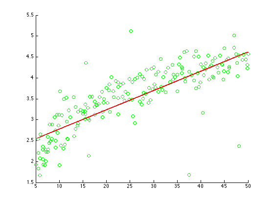
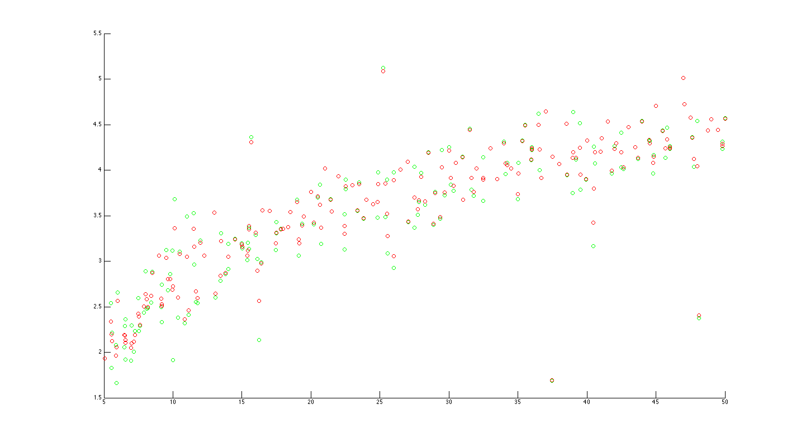
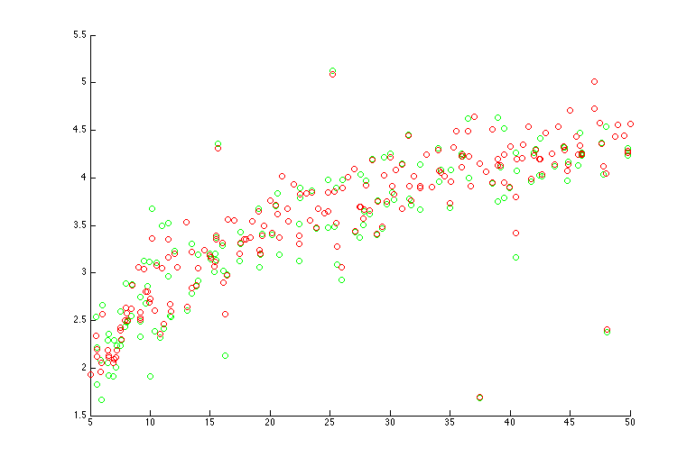
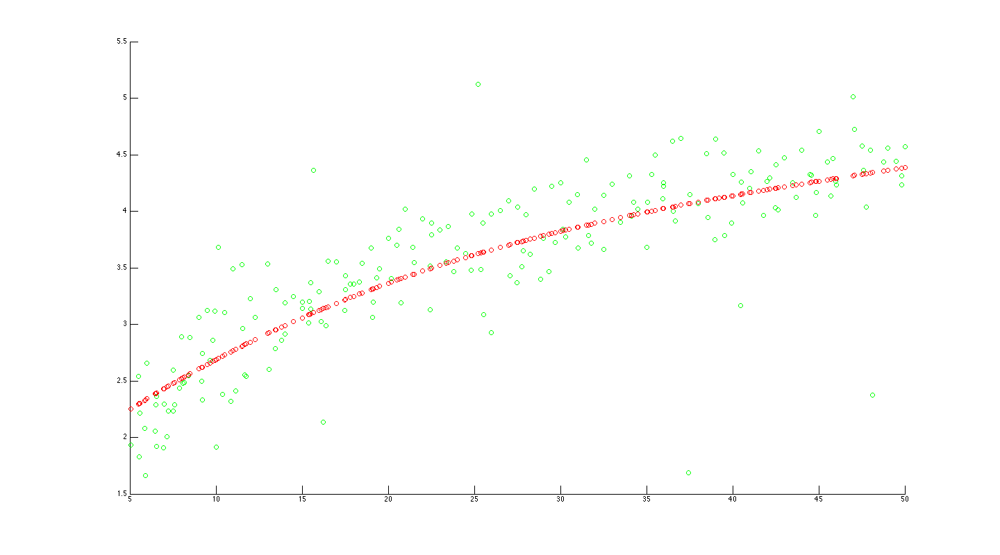
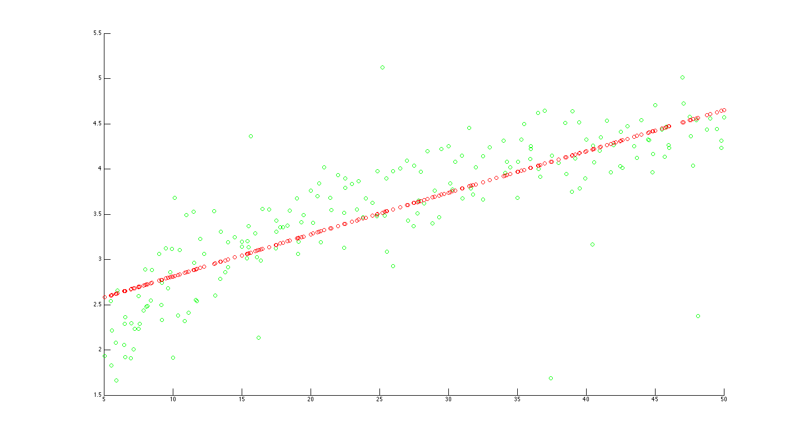

## ML Assignment 1

### Linear Regressor

- Implementation

    The method I used to solve the objective is gradient descent with a small learning rate to prevent the solver go too far.

    For more details, please refer to `+model/+regressor/LinearRegressor`.

- Output

    For the provided training data:

    The empirical is `39.7033`, and the trained model is `y = 2.3165 + 0.0461x`.

    And the plot looks like:
    

### Locally Weighted Linear Regressor

- Implementation

    For this coding assignment, I used `cvx` to solve the objective provided in `4(a)`.

- Output

    1. `tau` is `0.1`

    

    2. `tau` is `1`

    

    3. `tau` is `10`

    

    4. `tau` is `100`

    

- Discussion

    We can see the smoothness difference when different `tau` is set.

    When `tau` becomes larger, the weight goes to `1`. Resulting the predictions look like the result of linear regression.

    On the other hand, when `tau` becomes smaller, the weight goes larger and is dominated by the nearby points. Resulting the predictions look like position of nearby points.
